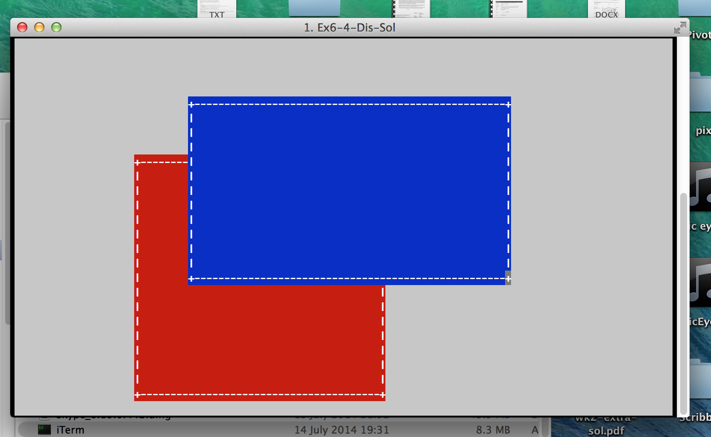

# Exercise 6

I thought I should provide an overview of both the content and the
procedure. But first, strategic thinkers will need to know the
**deadline**, which was 23:59.59 on Monday 25 May 2015.  **DEADLINE
EXTENSION:** you now have until 5pm on Wednesday 27 May 2015. That is,
I am giving you as much time as I can, still leaving enough of a
window to mark your stuff (not in your presence, this time) before the
deadline which will be imposed on me to return your scores to the exam
board.  (That deadline turned out to be later than I had anticipated,
so I'm passing the benefit on to you.)  You're playing for the last 25
of the 100 available marks.

**Request.** If you think you're done with exercise 6 before the
deadline, please let me know. It will significantly reduce my stress
levels if I can mark as much of your work as early as possible. Note
that I will still accept revised submissions up to the deadline (and
git will let me know that I need to look again). I'm afraid I can't
release scores early, but you'll more or less be able to tell what
your solutions are worth, anyway.

## What's it about?

The incremental release of this exercise rather obscures the big
picture, so let me try to sketch it. What you're writing is a simple
window manager, with overlapping windows. It'll be text-based and run
inside a shell window, just like the editor in exercise 5. At the end
of the day, you should have two windows with different stuff happening
in them: you should be able to switch focus between them, move them
and resize them.

## How does that break down?

It's a five episode story, hopefully not with cliffhangers.

1. **Vectors** where you learn the basics of working with lists whose
   size is policed by types. We'll be using vectors of vectors
   (matrices) to manage rectangular blocks of text.

2. **Boxes** where you learn to work with rectangular tilings built up
   from basic components by putting things the same height side by
   side or arranging two things the same width vertically.

3. **Cutting** where you learn to cut tilings as required, and to
   overlay one tiling in front of another, seeing stuff at the back
   through the holes in the front: the key technology for overlapping
   windows.

4. **Display** where you learn to construct tilings of display
   updates, and to send them to the screen. Of course, updates which
   happen out of view should result in no action. Here, we'll start to
   compile executables built from the pieces and control content from
   the keyboard.

   

5. **Applications** where you learn to build interactive systems which
   get keystrokes and give updates, then hang them in a framework
   which supports *two* of them in separate windows, cooperatively.

Edit: we're ahead of the game; episode 4 already has two windows!

## Mac Users

Don't use a regular terminal for this, as shift-up and shift-down
aren't handled properly. Give [iterm2](http://iterm2.com/) a go
instead. I'm grateful to Dan Piponi for this valuable clue.

## Support

We have two lecture slots booked for Tuesdays at 2pm in LT209. We
should probably use both for orientation: week 11 for episodes 1 to 3;
week 12 for episodes 4 and 5.

If you are in need of clarification about the intended meaning of
things I've written, please use the myplace forum: others probably
need the same help. If you have questions about *your code*, please
contact me privately.

I am willing to offer lab help if a bunch of you think that would be
useful, or one-on-one advice by appointment. Don't stay unproductively
stuck. I won't be out of town much, but I mightn't be in my office
much, so showing up at LT1317 unexpected is not the best strategy (but
I won't object if you try your luck). My currently scheduled
disappearances are as follows: 7 May is election day, when I vote (you
should, too) then sleep until polls close and it's time to spend all
night throwing things at the telly; 8 May is the day after election
day, when it will probably hurt; 12 May sees a meeting in Dundee about
Type Inference.

Support each other. Learn together; code separately. By all means talk
about the difficulties you get into, the better to gain understanding,
but make sure your code comes from your understanding, not from
somebody else's code.
